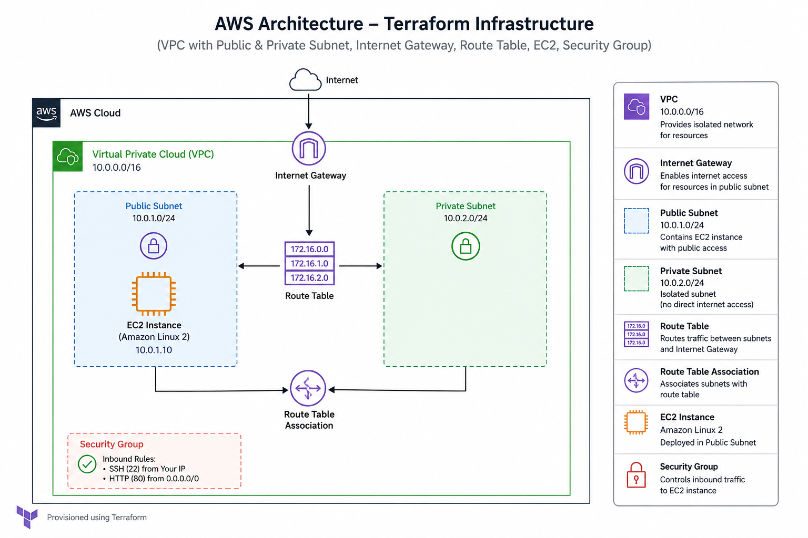

# Terraform and AWS: A Beginner's Guided Example



*Architecture created by this Terraform project.*

This repository is a hands-on introduction to Terraform. It creates a small AWS network and an EC2 web server, while demonstrating variables, outputs, modules, data sources, loops, local values, and conditional expressions.

You do not need to know Terraform before starting. Read the sections in order, run the commands one at a time, and inspect the plan before approving any change.

## What Terraform does

Terraform is an infrastructure-as-code tool. Instead of creating AWS resources by clicking through the console, you describe the desired result in `.tf` files. Terraform then:

1. Reads your configuration and compares it with its state file.
2. Builds a dependency graph, such as "create the VPC before the subnet".
3. Shows a proposed change with `terraform plan`.
4. Makes the approved change with `terraform apply`.

Terraform is declarative: you describe *what* should exist, not every API call needed to create it. Running `plan` again after nothing changed should normally produce no changes.

## What this project creates

The root configuration calls a reusable VPC module. Together they create:

- A VPC with CIDR range `10.0.0.0/16`.
- One public subnet and one private subnet.
- An Internet Gateway and a public route table.
- An Ubuntu 24.04 AMI lookup.
- An EC2 `t3.micro` instance in the public subnet.
- A security group allowing SSH from `my_ip` and HTTP from the internet.
- Two example S3 buckets using `for_each`.

The EC2 instance can incur AWS charges. This is a learning project, not a production-ready network. The private subnet has no NAT Gateway, so resources placed there do not have outbound internet access.

## Before you run it

You need:

- Terraform installed. Check with `terraform version`.
- An AWS account with permission to create VPC, EC2, IAM-related key-pair access, and S3 resources.
- AWS credentials configured through the AWS CLI (`aws configure`) or environment variables. Verify them with `aws sts get-caller-identity`.
- An AWS key pair named `learning-key` in the configured region. The EC2 resource refers to this existing key pair; this repository does not create it.
- Your public IP in CIDR notation, for example `203.0.113.10/32`. `/32` means one IP address.

Do not put AWS access keys in Terraform files or commit them. Use a separate learning account or a tightly restricted IAM identity wherever possible.

## How state evolved in this project

At the beginning, this project used Terraform's default **local backend**. In that setup, Terraform stored its state in a local `terraform.tfstate` file in the project directory. Local state is convenient for experimenting alone, but it is easy to lose, difficult to share, and unsafe to use when two people run Terraform at the same time.

The S3 backend was added later, after the AWS resources had already been developed. The current configuration therefore points at S3, while the state backup files in the repository show traces of the earlier local-state workflow. This is a useful progression to study:

1. Start with local state to understand the Terraform workflow.
2. Build and inspect the resources with `init`, `plan`, `apply`, and `destroy`.
3. Create a protected S3 bucket and move the existing state there.
4. Reinitialize Terraform so future runs use the shared backend.

### Initial local workflow

With the `backend "s3"` block temporarily removed or commented out, Terraform uses local state automatically:

```powershell
terraform init
terraform plan
terraform apply
```

Terraform writes the state locally. Do not use this mode for shared or production infrastructure, and do not commit the resulting state file.

### Important: the S3 backend

Configure `main.tf` to store Terraform state in an S3 bucket and AWS region that you control. The values below are generic examples:

```hcl
backend "s3" {
  bucket       = "your-terraform-state-bucket"
  key          = "terraform-learning/terraform.tfstate"
  region       = "your-aws-region"
  use_lockfile = true
}
```

Replace all three placeholders before running `terraform init`. S3 bucket names must be globally unique, so choose a name such as `my-terraform-state-12345`. The bucket must already exist in the selected region. A backend stores Terraform's record of what it manages; it is not an AWS resource that this configuration creates. State can contain sensitive information, so protect the bucket and never commit `.tfstate` files.

If you do not own this bucket, change the backend to a bucket you control before initializing, or temporarily remove the `backend "s3"` block for local-only learning. When moving existing local state to S3, keep the same resource configuration and run:

```powershell
terraform init -reconfigure
```

Terraform will ask whether the existing local state should be copied to the new backend. Confirm that only when the destination bucket and key are correct. `-reconfigure` tells Terraform to use the new backend configuration; it does not create the bucket.

Do not delete or overwrite shared state without understanding who uses it.

## First run

From this directory, run the following in order:

```powershell
terraform init
terraform fmt -recursive
terraform validate
terraform plan
```

`init` downloads the AWS provider and initializes the backend. `fmt` applies Terraform's standard formatting. `validate` checks configuration structure. `plan` is a preview: it does not create resources.

Read the plan carefully. If it looks correct, create the resources:

```powershell
terraform apply
```

Terraform asks for confirmation. Type `yes` only after reviewing the plan. When it finishes, Terraform prints the outputs, including the EC2 public IP. You can print them later with:

```powershell
terraform output
terraform output ec2_public_ip
```

## Learn the files in this order

Terraform automatically loads every `.tf` file in one directory, so the filename does not control execution order. `varibles.tf` is misspelled, but Terraform still loads it because it ends in `.tf`.

1. **[main.tf](main.tf)**: required AWS provider, S3 backend, security group, EC2 instance, AMI data source, and VPC module call.
2. **[modules/vpc/main.tf](modules/vpc/main.tf)**: the VPC, subnets, Internet Gateway, route table, and route association resources.
3. **[modules/vpc/variables.tf](modules/vpc/variables.tf)**: inputs accepted by the module.
4. **[modules/vpc/outputs.tf](modules/vpc/outputs.tf)**: values returned by the module to the root configuration.
5. **[varibles.tf](varibles.tf)**: root input variables and their defaults. A variable is a configurable input rather than a hard-coded value.
6. **[outputs.tf](outputs.tf)**: useful values displayed after apply.
7. **[locals.tf](locals.tf)**: calculated values and shared tags. Locals are named expressions used inside the configuration.
8. **[count.tf](count.tf)**: a `for_each` example. The commented block shows the alternative `count` approach.
9. **[for_expression.tf](for_expression.tf)**: list and map comprehensions, `lookup`, and `try`.
10. **[ternery_expressions.tf](ternery_expressions.tf)**: a conditional expression. The filename is misspelled, but the file is valid Terraform.

## Core Terraform ideas in this example

### Resources

A resource creates or manages something. For example, `aws_instance.web` is the Terraform address of the EC2 instance. References such as `aws_security_group.ec2.id` connect resources and create dependencies.

### Providers

A provider is a plugin that translates Terraform configuration into API calls for a platform. This project uses the AWS provider, constrained to version 5.x by `version = "~> 5.0"`.

### Modules

A module is a folder of Terraform configuration that can be reused. The root module passes values to `modules/vpc`:

```hcl
module "vpc" {
  source       = "./modules/vpc"
  vpc_cidr     = var.vpc_cidr
  public_subnet_cidr = "10.0.1.0/24"
  # other module inputs omitted here
}
```

The child module creates resources privately and exposes selected IDs through outputs. The root uses those outputs as `module.vpc.public_subnet_id` and `module.vpc.vpc_id`.

### Variables, locals, and outputs

- **Variables** are inputs, such as `var.instance_type`.
- **Locals** are reusable calculated expressions, such as common tags.
- **Outputs** are values Terraform prints for people or other modules.

Override a default without editing the source:

```powershell
terraform plan -var="instance_type=t3.small" -var="my_ip=203.0.113.10/32"
```

For repeatable settings, create a local `terraform.tfvars` file. Do not commit personal IP addresses or secrets.

### Data sources

`data "aws_ami" "ubuntu"` reads an existing AMI instead of creating one. Its filters select the most recent Ubuntu 24.04 image owned by Canonical. The instance then uses `data.aws_ami.ubuntu.id`.

### `count`, `for_each`, and `for` expressions

- `count` creates numbered instances such as `resource.name[0]`.
- `for_each` creates instances keyed by a set or map, such as `aws_s3_bucket.demo["dev"]`.
- A `for` expression transforms a collection into another collection.

In this project, `count.tf` creates `dev` and `prod` S3 buckets with `for_each`. Read the commented `count` version to compare the two addresses and their behavior when items are added or removed.

### Terraform state

State maps Terraform addresses to real AWS objects. It lets Terraform calculate what has changed. The S3 backend makes this state available to collaborators and enables locking with `use_lockfile = true`.

Useful inspection commands:

```powershell
terraform state list
terraform show
terraform output
```

Treat state as sensitive. Do not edit it by hand.

## Clean up

When finished, remove the resources created by this project:

```powershell
terraform destroy
```

Review the destroy plan and confirm it. Also remove any test S3 buckets you created separately for the backend, following your team's state-retention policy. Check the AWS console afterward because costs can continue if resources remain.

## A good learning exercise

1. Run `terraform plan` and identify every resource Terraform wants to create.
2. Change `instance_type` with `-var` and compare the plans.
3. Change the `my_ip` value and observe the security group diff.
4. Read the VPC module's inputs and outputs, then trace each `module.vpc.*` reference from the root.
5. Try `terraform plan -out=tfplan`, inspect it with `terraform show tfplan`, and apply that exact plan with `terraform apply tfplan`.

## Useful commands

| Command | Purpose |
| --- | --- |
| `terraform init` | Initialize the working directory and download providers |
| `terraform fmt -recursive` | Format Terraform files |
| `terraform validate` | Validate configuration syntax and structure |
| `terraform plan` | Preview changes |
| `terraform apply` | Apply changes after confirmation |
| `terraform output` | Display root outputs |
| `terraform state list` | List objects tracked in state |
| `terraform destroy` | Remove managed resources |

## Continue learning

- [Terraform language documentation](https://developer.hashicorp.com/terraform/language)
- [Terraform CLI documentation](https://developer.hashicorp.com/terraform/cli)
- [AWS provider documentation](https://registry.terraform.io/providers/hashicorp/aws/latest/docs)
- [Terraform state documentation](https://developer.hashicorp.com/terraform/language/state)
